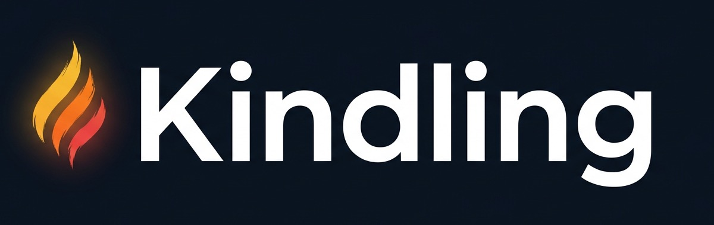
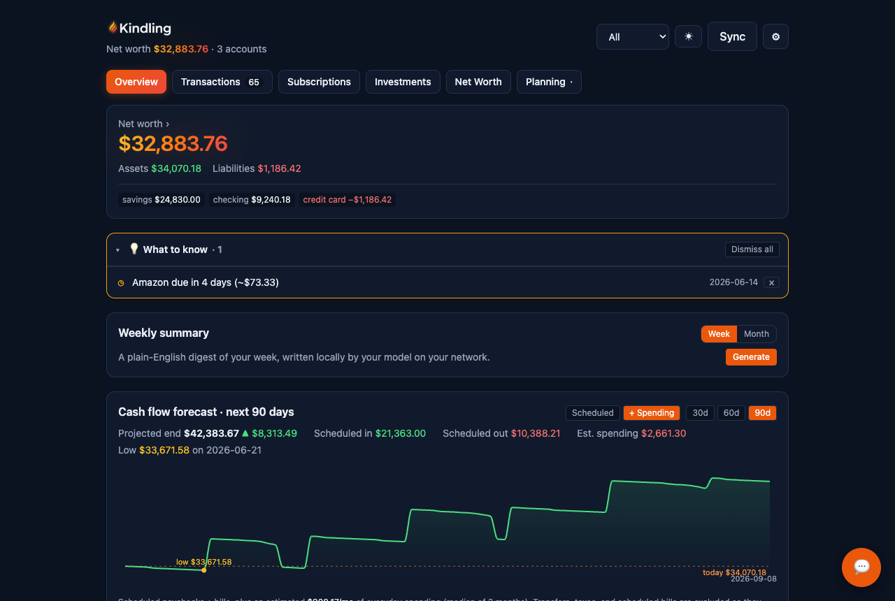
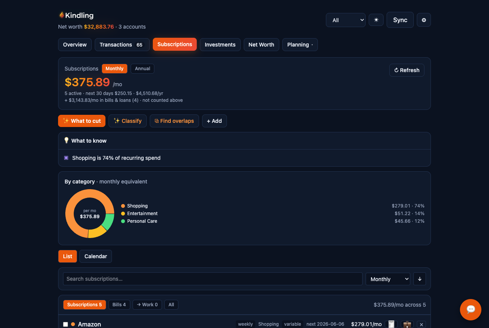

<p align="center">
  
</p>

<p align="center"><strong>Self-hosted personal finance. Your money, your hardware, your model.</strong></p>

<p align="center">
  <a href="LICENSE"></a>
  
  
  
  
  
</p>

---

<p align="center">
  
</p>
<p align="center"><sub>The night-hearth theme on <strong>Plaid Sandbox data</strong>. Every screenshot in this repo is fake money; real financial data never reaches git.</sub></p>

Real bank data via [Plaid](https://plaid.com), everything else on hardware you
own, **~$0/year**. A Copilot Money / Monarch replacement built around one idea:
**your financial data, and the AI that reads it, never have to leave your
network.**

Kindling is the daily-money companion in a small family of fire-themed finance
apps (its sibling **EmberPlan** handles FIRE planning). Kindling is what you
tend every day so the ember catches. 🔥

## Why it exists

Hosted finance apps cost ~$100/yr, ship your transactions to their cloud, and
increasingly pipe them through third-party LLMs. Kindling flips all three:
Plaid's free tier covers a typical household (10 institutions), the app runs
on any always-on box you already have, and the AI layer points at whatever
OpenAI-compatible endpoint you choose. Run a local model and nothing leaves
your network.

## What you get

- 🏦 **Plaid sync:** banks + brokerages, cursor-based transaction sync,
  balances, investment holdings
- 🏷️ **Categorization that's yours:** Plaid's taxonomy → *your editable
  rules* → an LLM tail for the ambiguous remainder, with write-back so good
  calls become rules. To-Review inbox, one-tap AI suggestions, propagation
  with undo
- 🔁 **Subscriptions:** Plaid Recurring + an in-house detector; price-hike /
  unused / trial flags; what-if-cancel (tick rows, watch the $/mo drop); an AI
  cut-plan; cancel guides; a charge calendar
- 📈 **Net worth that thinks:** knows linking an account is new *visibility*,
  not new money. Manual assets/debts with AI valuation, amortizing loans,
  equity-grant vesting with live quotes
- 🔮 **Forward-looking:** cash-flow forecast, budgets, goals, tax planning
- 💬 **Chat with your money:** text-to-SQL over a read-only connection, every
  query gated by a validator
- ✉️ **Weekly digest:** optional plain-English email (Resend)
- 🌗 **Ember themes:** navy night-hearth dark and warm-paper light, one tap

<p align="center">
  
</p>
<p align="center"><sub>The subscription leak-ledger, again on Sandbox data: live $/mo hero, what-if-cancel, AI cut-plan.</sub></p>

## The privacy posture

| Layer | Stance |
|---|---|
| Dashboard | Private network only (Tailscale or similar); never public |
| Webhooks | Optional; exactly one public path, Plaid-JWT-verified, signal-only |
| Plaid tokens | AES-256-GCM encrypted at rest |
| LLM | Any OpenAI-compatible endpoint; local = data stays home; UI flags local vs remote per model |
| Chat SQL | Read-only connection, single-SELECT + table allowlist, injected LIMIT |
| Repo | `finance.db`, screenshots, and deploy overrides are gitignored; real data never reaches git |

## Quickstart (Plaid Sandbox)

```bash
git clone https://github.com/BioInfo/kindling && cd kindling
npm install
# secrets: export PLAID_CLIENT_ID / PLAID_SECRET / APP_ENC_KEY,
# or store them in `pass` (api-keys/plaid-client-id, api-keys/plaid-secret-sandbox)
./run.sh dev        # http://localhost:3408
```

Open the app → **Connect a bank**. In Sandbox use Plaid's test credentials
(`user_good` / `pass_good`, any OTP), then **Sync**.

Per-deployment config (gateway URLs, model names) goes in `local.env`: see
[`local.env.example`](local.env.example). Every AI feature is best-effort and
degrades cleanly if no gateway is configured.

## Or hand it to your agent

The 2026 install path: paste this into Claude Code (or Cowork, or any capable
coding agent) and let it drive. It will ask you for the two human steps
(creating the free Plaid account, approving anything irreversible) and handle
the rest.

```text
Install Kindling, the self-hosted personal finance app, from
https://github.com/BioInfo/kindling. Clone it, check my Node version
(node:sqlite needs Node 22.5+), install dependencies, and read README.md and
PLAN.md before changing anything. Then walk me through Plaid credentials:
help me create a free account at dashboard.plaid.com, find my client_id and
Sandbox secret, and store them the way I prefer (pass entries
api-keys/plaid-client-id and api-keys/plaid-secret-sandbox, or exported env
vars). Generate an APP_ENC_KEY for me with openssl rand -hex 32. Start the
app with ./run.sh dev, confirm http://localhost:3408 responds, and walk me
through connecting Plaid's sandbox bank (user_good / pass_good, any OTP).
LLM features are optional: if I have an OpenAI-compatible endpoint (Ollama
counts), wire it up via local.env using local.env.example; otherwise skip,
everything degrades cleanly. When I'm ready for real accounts, walk me
through Plaid Production access and PLAID_ENV=production, and remind me to
keep the app private-network-only. Ask before anything irreversible.
```

## Going to production

1. Get Plaid Production keys (free tier: 10 Items), store the secret in `pass`
   as `api-keys/plaid-secret-production`.
2. `PLAID_ENV=production ./run.sh dev` and connect real accounts.
3. For always-on serving: `start-prod.sh` builds once and serves with
   `next start` ([`deploy/`](deploy/) has LaunchAgent templates), behind
   `tailscale serve` or your reverse proxy of choice. Never expose it publicly.

Architecture, security model, and design principles: [`PLAN.md`](PLAN.md).

## Stack

[Next.js](https://nextjs.org) (App Router, TypeScript) ·
[`node:sqlite`](https://nodejs.org/api/sqlite.html) (zero native build steps) ·
[Plaid Node SDK](https://github.com/plaid/plaid-node) ·
[Recharts](https://recharts.org) · any OpenAI-compatible LLM gateway

## License

[MIT](LICENSE)
